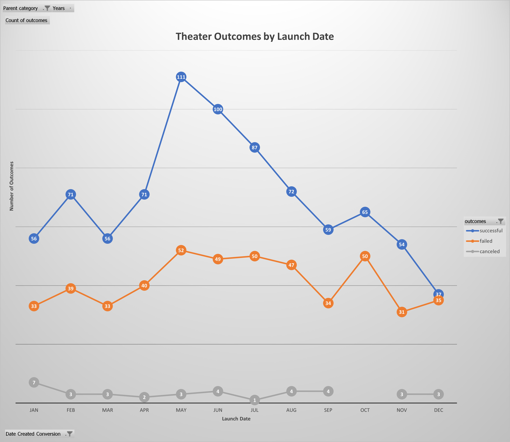
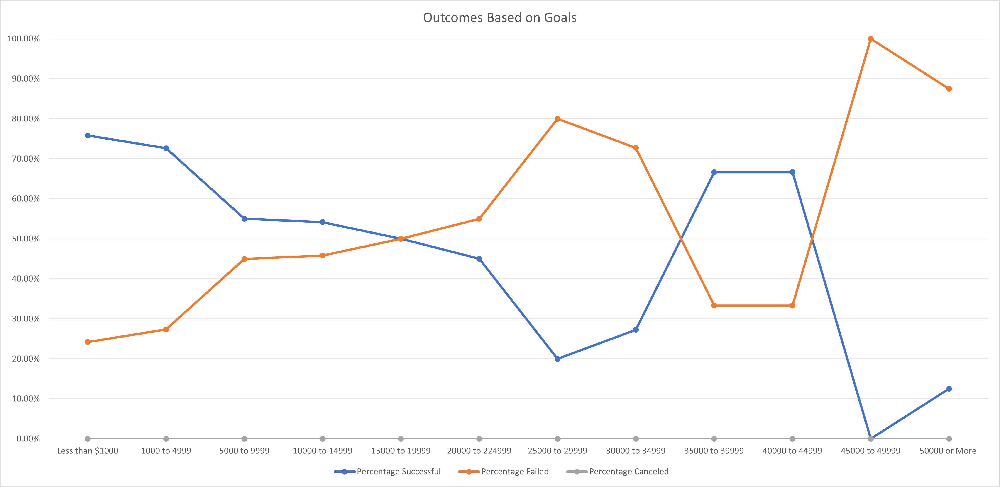

# Kickstarting with Excel

## Overview of Project

### Purpose
Louise wants to know how different Kickstarter campaigns preformed in reference to their launch dates and campaign goals.  The data from 4114 Kickstarter campaigns was provided, but the results relevant to Louise’s desired information uses 1369 theater and 1047 play campaigns.  From the background information provided: “Louise’s play Fever came close to its fundraising goal in a short amount of time.” The purpose of the project is to provide Louise information to run successful Kickstarter campaigns in the future.  To achieve this goal previous campaign data will be utilized to help inform choices on what month to start a theater campaign and the Goal amounts that are most successful for play campaigns. 

## Analysis and Challenges

### Analysis of Outcomes Based on Launch Date
The launch date data shows that the most successful period (by number of campaigns) is May and June.  However, by percentage 8 months showed campaigns with a success rate over 60%.  January, August, October, December all had the success rate of the campaign fall below 60% with December showing the worst percentage at 49.33%.  May, June, July, and August were the months with the highest number of campaigns (166,153,138,123).  May had the highest number of campaigns started (166 and the highest percentage of successful campaigns at 66.87%.  

### Analysis of Outcomes Based on Goals
Outcomes based on goals shows that the most successful amount (by number of campaigns) is Less than $1000 (75.81%) and $1000 to $4999 (72.66%).  Generally, the percentage of successful campaigns decreases until a sudden jump in the success of campaigns with ranges of $35000 to $39999 (66.67%), and $40000 to $44999 (66.67%).  It is worth noting that every goal amount group with over $25,000 goal had under 20 projects each.  The smaller number of campaigns reviewed in each group would allow variables not considered in this analysis to possible skew the numbers.  Based on the data provide and discounting groups with smaller samples, the best chance of a successful campaign would have a goal of no more than $4999.  

### Challenges and Difficulties Encountered
Some of the challenges/difficulties with this project including further parsing out data from the raw dataset to be able to meet the desired criteria.  Anytime additional columns are created based on other columns in the workbook it allows for a chance of error in a formula or small differences in labels (from the raw data) not being included in the new column.  Furthermore, the results desired are based on two different categories, Launch Date is based on the Parent Category while the Outcomes based on Goals is based on a Subcategory.  The switching of data review could allow for some results to not be as relevant if reviewing the results combined (trying to figure out a launch date and dollar amount for a new play).   

## Results
The best months to start a Theater Campaign are May and June.  However, all months have a greater than 50% chance of succeeding, with the exception of December (49.33%).  The main take away from the Theater Outcomes by Launch Date is to not start a campaign in December.  To increase the chances of hitting goal for a campaign the ideal target would be less than $5000.  Although all groupings under $20000 had a 50% or greater chance of success.  A limiting factor of the results stem from the dataset provided not containing results after 2017, so for a campaign starting in 2022 new data would need to be obtained.  Also, it would be recommended to create graphs based on the same Parent or Subcategory to make sure the trends hold true when comparing “Apples to Apples”.   Though not available in this dataset, the type of performance could be a relevant variable (musical, comedy, drama, etc…) to deciding the chances of success for a play.  The final graph I would add, but not included in the data is the economic trends during the timeframe of the data being reviewed.  A sudden economic growth or decline could heavily influence the willingness of people to fund a project.  